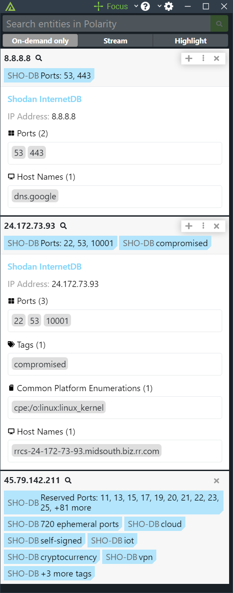

# Polarity Shodan InternetDB Integration

The Shodan InternetDB API provides a fast way to see the open ports for an IP address. It gives a quick, at-a-glance view of the type of device that is running behind an IP address to help you make decisions based on the open ports.

In addition to open ports, Shodan InternetDB provides a list of vulnerabilities, cpes, hostnames and tags.  The API data is updated once a week. 

To learn more about Shodan InternetDB, visit the [official website](https://internetdb.shodan.io/).

## Installation Instructions

Installation instructions for integrations are provided on the [PolarityIO GitHub Page](https://polarityio.github.io/).

## Polarity

Polarity is a memory-augmentation platform that improves and accelerates analyst decision making. For more information about the Polarity platform please see:

https://polarity.io/
